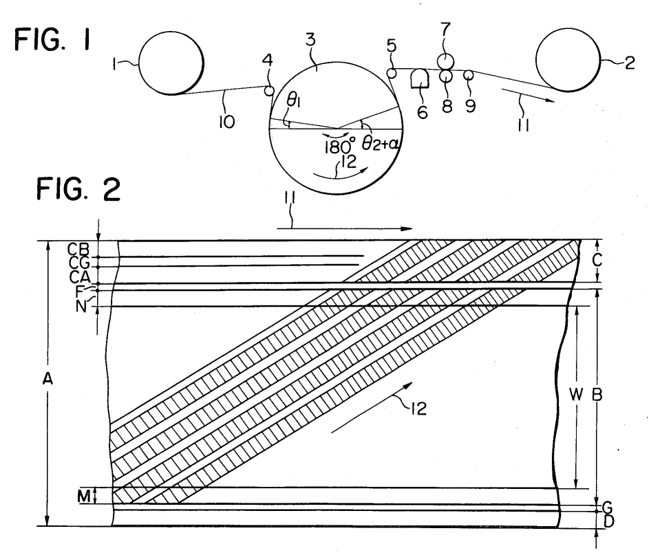
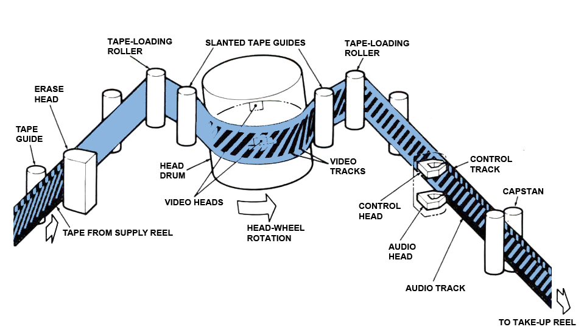

# Theory

The goal of the project is an accurate digital representation of a physical VHS tape medium, made from two parts: an encoder that produces a near-physical representation byte stream from a raw video stream, and a decoder which turns such a stream (possibly distorted, or with distortions applied) back to a raw video. **Early WIP.**

## Excerpts from [https://en.wikipedia.org/wiki/VHS] and related

The tracks are packed on the tape using the helical scan technique:

Each diagonal track corresponds to one complete television field (which is, only even or only odd rows of a frame). Despite it's not very correct for slant-azimuth recording, the tracks may still be considered as having safety intervals between, filled with noise.

HBIs are recorded in the video tracks and are intentionally aligned against adjacent tracks (which is why VHS, unlike analog TV, rarely has severe horizontal sync problems). VBI seems to be put separately in the control track, still it's possible to [recover](https://github.com/ali1234/vhs-teletext) (highly damaged) teletext from there.

Both the tape is pulled and the head drum is rotated (at 1800 rpm for NTSC and 1500 rpm for PAL) simultaneously, and those should be fine-aligned, so a head, which is fixed in a certain position on the drum, passes along the track as the tape moves, ideally in the middle of the track. Any misalignments lead to a brightness loss, or to more severe tracking issues. There are at least two heads on a drum actually (one for odd fields and one for even fields).

* Digital equivalents for video resolution:
  * NTSC:
    * 333×480 for luma
    * 40×480 for chroma
  * PAL:
    * 335×576 for luma
    * 40×576 for chroma

## Format details

A stream of (uint16?) values representing the magnetic level in the point of a tape, serialized orthogonally to the tape: bottom-to-top, beginning-to-end.

This means, due to helical scanning, a pretty big RAM buffer would be needed to read just a single frame, as parts of it need to be recovered from many adjacent tape-orthogonal lines. The same applies to encoding: several frames need to be accumulated before first tape-orthogonal rows can be yielded and discarded from the RAM.

TODO: calculate the tape sampling resolution and the bit depth (based on the fact there is as an approximately 3 MHz bandwidth for video).

## Implementation notes

The prototype would be focused only on the video part. Audio track may be added later as well, as muxing raw video and audio inputs is far more complex than just one of them.

The near-physical format is going to be extremely excessive, thus may be not suitable for real-time processing even on high-end CPUs, as well as for storing on non-volatile mediums rather than being piped via sockets and RAM buffers only. Sorry.

More efficient implementations for certain effects may be developed later after experimenting with this one.

# Possibilities

* Fastscan mode (where parts of several frames are displayed, separated by noise stripes)
* Partially rewritten tape mode (the erasing head is orthogonal against the tape, so several frames gradually reveal from noise)
* Tape degradation (tracking errors, tape misalignment, speed instability, etc.)
* etc.
