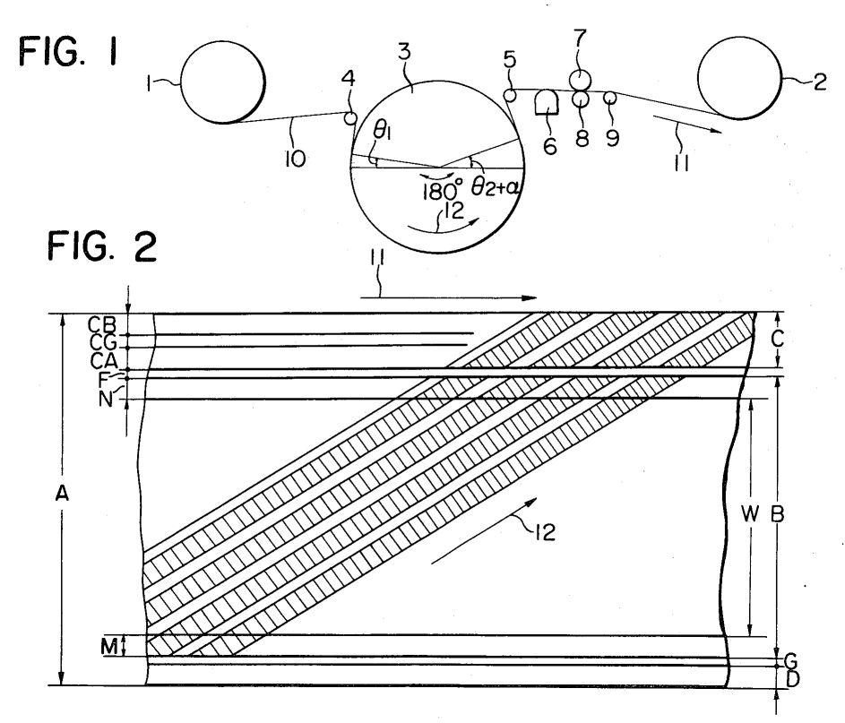
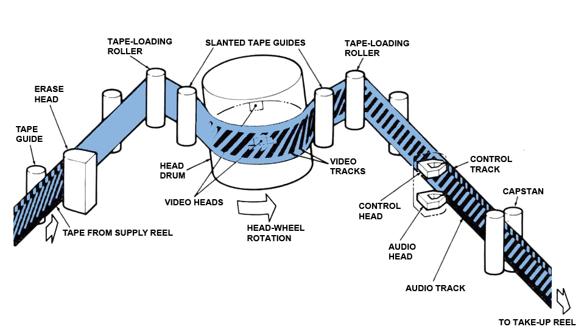

# Theory

The goal of the project is an accurate digital representation of a physical VHS tape medium, made from two parts: an encoder that produces a near-physical representation byte stream from a raw video stream, and a decoder which turns such a stream (possibly distorted, or with distortions applied) back to a raw video. **Early WIP.**

## Excerpts from [https://en.wikipedia.org/wiki/VHS] and related

The tracks are packed on the tape using the helical scan technique:

Each diagonal track corresponds to one complete television field (which is, only even or only odd rows of a frame). Despite it's not very correct for slant-azimuth recording, the tracks may still be considered as having safety intervals between, filled with noise.

HBIs are recorded in the video tracks and are intentionally aligned against adjacent tracks (which is why VHS, unlike analog TV, rarely has severe horizontal sync problems). VBI seems to be put separately in the control track, still it's possible to [recover](https://github.com/ali1234/vhs-teletext) (highly damaged) teletext from there.

Both the tape is pulled and the head drum is rotated (at 1800 rpm for NTSC and 1500 rpm for PAL) simultaneously, and those should be fine-aligned, so a head, which is fixed in a certain position on the drum, passes along the track as the tape moves, ideally in the middle of the track. Any misalignments lead to a brightness loss, or to more severe tracking issues. There are at least two heads on a drum actually (one for odd fields and one for even fields).

* Digital equivalents for video resolution:
  * NTSC:
    * 333×480 for luma
    * 40×480 for chroma
  * PAL:
    * 335×576 for luma
    * 40×576 for chroma

## Format details

A stream of (uint16?) values representing the magnetic level in the point of a tape, serialized orthogonally to the tape: bottom-to-top, beginning-to-end.

This means, due to helical scanning, a pretty big RAM buffer would be needed to read just a single frame, as parts of it need to be recovered from many adjacent tape-orthogonal lines. The same applies to encoding: several frames need to be accumulated before first tape-orthogonal rows can be yielded and discarded from the RAM.

TODO: calculate the tape sampling resolution and the bit depth (based on the fact there is as an approximately 3 MHz bandwidth for video).

## Implementation notes

The prototype would be focused only on the video part. Audio track may be added later as well, as muxing raw video and audio inputs is far more complex than just one of them.

The near-physical format is going to be extremely excessive, thus may be not suitable for real-time processing even on high-end CPUs, as well as for storing on non-volatile mediums rather than being piped via sockets and RAM buffers only. Sorry.

More efficient implementations for certain effects may be developed later after experimenting with this one.

# Possibilities

* Fastscan mode (where parts of several frames are displayed, separated by noise stripes)
* Partially rewritten tape mode (the erasing head is orthogonal against the tape, so several frames gradually reveal from noise)
* Tape degradation (tracking errors, tape misalignment, speed instability, etc.)
* etc.

# Useful links

* https://github.com/oyvindln/vhs-decode

# Glory to AI!

### Track Layout and Dislocation
- VHS tapes utilize **helical-scan recording**, where the tape is wound around a rotating drum at an angle. This design allows for diagonal tracks on the tape.
- Each track carries one field of video information, with alternating fields providing a complete frame of the video signal.

### Bandwidth and Frequency
- Video bandwidth: Approximately **3 MHz**. This allowed for the storage of the video signal, though the resolution was limited compared to later formats.
- Audio bandwidth: Around **20 kHz**, which was sufficient for mono or stereo audio signals.
- The RF carrier for the video signal was modulated at approximately **3.8 MHz**, with chrominance (color information) separated and frequency-modulated.

### Track and Head Dimensions
- The width of a track: **58 microns**.
- Head width: Slightly narrower than the track width to ensure precise alignment during playback.
- The tape itself: **12.7 mm (0.5 inches)** wide.

### Signal Formats and Carriers/Subcarriers
- VHS used a **composite video signal**, separating luminance (brightness) and chrominance (color) information.
- Luminance signal: Stored using FM (frequency modulation) to minimize noise.
- Chrominance signal: Downconverted and stored using a lower subcarrier frequency (approximately **629 kHz**) to reduce interference.

This system ensured compatibility with NTSC, PAL, and SECAM standards, depending on regional formats. Despite limitations in resolution (~240 horizontal lines for NTSC), VHS dominated the consumer market for decades due to its affordability and convenience.

### **Track Angle**
- The tracks on the tape are recorded at an angle of approximately **6 degrees** to the tape's edge. This diagonal track orientation is made possible by the helical-scan design.

### **Speeds**
- **Tape speed**: During playback, the tape moves at approximately **3.335 cm/second** (for NTSC standard VHS tapes). PAL tapes have a slightly different speed of about **2.339 cm/second**.
- **Drum speed**: The rotating drum, which houses the heads, spins at **1,800 RPM** (revolutions per minute) for NTSC and **1,500 RPM** for PAL. This high-speed rotation ensures that the heads scan the diagonal tracks effectively despite the relatively slow tape movement.

### **Why Noise Strips Appear When Cueing**
When a video is cued (fast-forward or rewound at visual speed):
1. **The tape moves faster than during standard playback**, which disrupts the precise alignment between the tape tracks and the video heads.
2. The heads can only intermittently read fragments of the video signal, leading to noise or "strips" on the screen.
3. **Dependence on the number of heads**:
   - A standard VHS drum typically has **two heads**, and during cueing, neither of them remains perfectly aligned with the tracks, causing frequent interruptions in the signal.
   - Higher-end VHS systems with **four heads** improve cueing and playback quality. Two additional heads are optimized for high-speed operations, allowing better alignment with the tracks even during fast-forward or rewind, thereby reducing noise strips.

Let’s break this down step by step to address all aspects of VHS tracking and associated issues:

---

### **What Happens During Tracking Problems**
Tracking problems occur when the VCR’s video heads are misaligned with the recorded tracks on the tape. This misalignment means the heads can't read the video and audio signals properly, leading to visual noise (static or distortions) and/or audio disruptions.

---

### **Do Tracking Issues Happen Because of Tape Wear or Non-Linear Stretching?**
Yes, tape wear and non-linear stretching are common causes of tracking problems. Over time:
1. **Physical Wear**:
   - The magnetic coating on the tape surface can degrade with repeated use, handling, or improper storage, reducing the signal strength.
   - Damage like creases or wrinkles in the tape can cause uneven playback.
2. **Stretching**:
   - Non-linear stretching occurs due to tension changes as the tape moves through the VCR. This stretching subtly alters the position of the recorded tracks, making it harder for the heads to align with them.
3. **Environmental Factors**:
   - Humidity and temperature variations can deform the tape, causing tracking irregularities.

---

### **Why Do Noise Sections Tend to Appear at the Bottom?**
The bottom of the screen often shows noise due to the physical layout of the VCR’s video heads and the tape tracks:
1. VHS heads scan tracks diagonally, starting at the top of the image and ending at the bottom.
2. Misalignment (caused by tape wear or poor tracking) often affects the ends of the tracks—towards the bottom—first. This is where the scanning precision is most vulnerable.
3. During playback, if the tracking signal (from the control track) isn't perfect, the VCR’s heads may skip or misinterpret parts of the tracks, causing noise that manifests at the bottom.

---

### **Why Do Discoloration Issues Appear at the Bottom?**
1. **Signal Loss**:
   - At the edges of each track, there’s a higher likelihood of signal degradation. Color signal (chrominance) is especially delicate and may appear unstable, leading to discoloration.
2. **Timing Inaccuracies**:
   - The control track, a linear track on the edge of the tape, governs timing for synchronization. Errors in reading the control track can lead to improper reconstruction of the chroma signal, causing discoloration.

---

### **How Does a VCR Respond to Tracking Problems?**
The VCR uses the **control track** to synchronize the video heads with the recorded tracks. Here's what happens during automatic and manual tracking adjustments:
1. **Control Track Adjustment**:
   - The control track runs longitudinally along the tape and provides the timing reference. If the playback timing doesn’t match the control track, the VCR adjusts the drum’s rotation speed slightly to align the heads better.
2. **Servo Mechanisms**:
   - Advanced servo mechanisms adjust the angle and positioning of the video heads to optimize their alignment with the tracks.
3. **Manual Tracking**:
   - When the user adjusts tracking manually (via a dial or buttons), they alter the head positioning slightly. This helps compensate for tape irregularities like stretching or wear.

While these mechanisms help reduce visible noise, extreme wear or damage may exceed the VCR's ability to compensate. That’s why older tapes often require more frequent manual tracking adjustments.

---

Let’s unravel these details about VHS technology step by step:

---

### **Direction of Drum Spin**
- The drum spins **clockwise** relative to the tape during playback and recording.
- Frames are recorded so that **the top of the image corresponds to the uppermost part of the diagonal track** on the tape, and the bottom aligns with the lower part. This means frames are recorded in their correct orientation, not upside down.

---

### **Audio Recording**
1. **Mono Compatibility**:
   - The **linear audio track** runs along one edge of the tape and is always mono. It was designed for compatibility, ensuring that all VCRs could play back audio regardless of stereo capability.
2. **Stereo Audio (Hi-Fi Track)**:
   - Stereo audio is recorded on a **separate Hi-Fi track**, embedded within the tape’s video tracks using frequency modulation (FM). This design provides higher-quality stereo sound without interfering with the linear mono track.
   - The mono track cannot be split in half for stereo sound—it remains distinct for backward compatibility, while stereo is solely handled by the Hi-Fi track.

---

### **Physical Widths of Tracks and Gaps**
- **Total tape width**: **12.7 mm (0.5 inches)**.
- **Video tracks**: Each diagonal track is approximately **58 microns** wide.
- **Audio/control tracks**:
   - The **linear audio track** and **control track** run longitudinally along the edges of the tape. These tracks are much narrower compared to the video tracks.
- **Gaps**:
   - There are **tiny gaps between the diagonal video tracks** to ensure that adjacent tracks don’t overlap. These gaps are less than a micron wide, allowing for precise head alignment during playback.

---

### **Handling the Vertical Blanking Interval (VBI)**
1. **Recording the VBI**:
   - VHS systems typically record the entire video signal, including the **VBI**, from the source TV signal. This includes essential information like synchronization pulses and closed captions.
   - The recorded VBI is often slightly compressed due to the limitations of VHS video bandwidth.
2. **Recreation of VBI**:
   - During playback, if lines within the VBI were skipped or distorted during recording, the VCR’s circuitry recreates missing timing information to maintain synchronization.
3. **Frame End and Start Decisions**:
   - The VCR decides where to end one frame and start another based on the timing signal provided by the control track. The control track ensures that each diagonal track corresponds precisely to one field (not a full frame) of video.
4. **Syncing with Distorted TV Signals**:
   - If the source TV signal is heavily distorted, the VCR may struggle to interpret the sync pulses within the VBI. This can result in:
     - Misalignment of the tracks.
     - Skipped or corrupted fields during recording.
     - Noise and tracking issues during playback as the VCR tries to recover lost sync information.

---

On a VHS tape, the tracks are arranged to accommodate different types of information required for playback. Here’s the **order of tracks** from one edge of the tape to the other, along with their approximate **physical widths**:

1. **Control Track**:
   - Located on the edge of the tape.
   - Width: **~0.75 mm**.
   - Function: Contains timing information to synchronize the rotation of the drum and the movement of the tape. It ensures accurate playback and tracking.

2. **Linear Audio Track**:
   - Adjacent to the control track.
   - Width: **~0.6 mm**.
   - Function: Stores the mono audio signal (or cue track in some professional variants). Always separate from Hi-Fi stereo tracks.

3. **Video Tracks** (Diagonal Tracks):
   - These dominate the central portion of the tape, recorded at a diagonal angle by the rotating drum.
   - Width: **~58 microns per track**.
   - Function: Hold the video signal, with each track storing one field of video (alternating between odd and even fields for interlaced signals). Hi-Fi stereo audio is embedded in these tracks using FM.

4. **Guard Bands** (Gaps Between Video Tracks):
   - Width: **Less than 1 micron**.
   - Function: Separate adjacent video tracks to prevent crosstalk and interference between fields.

5. **Unused Edge**:
   - A small portion of the tape is typically unused along the opposite edge to provide mechanical stability.

The linear audio and control tracks are longitudinally oriented along the tape edges, while the video tracks are recorded diagonally due to the helical-scan method.
